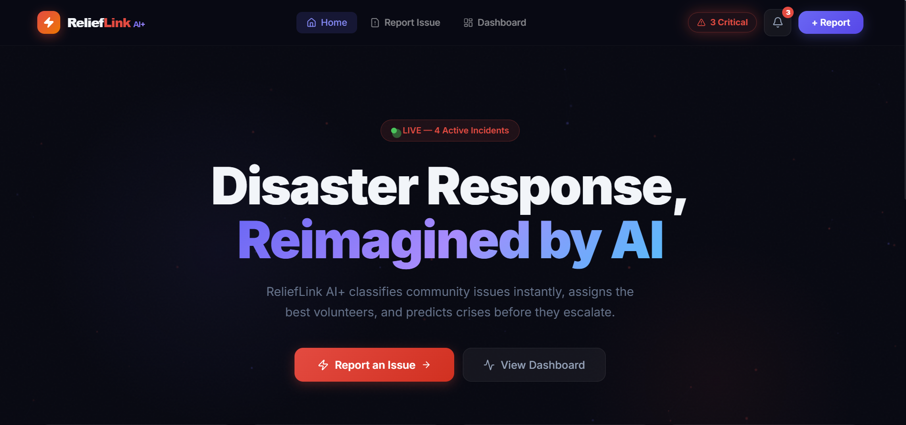
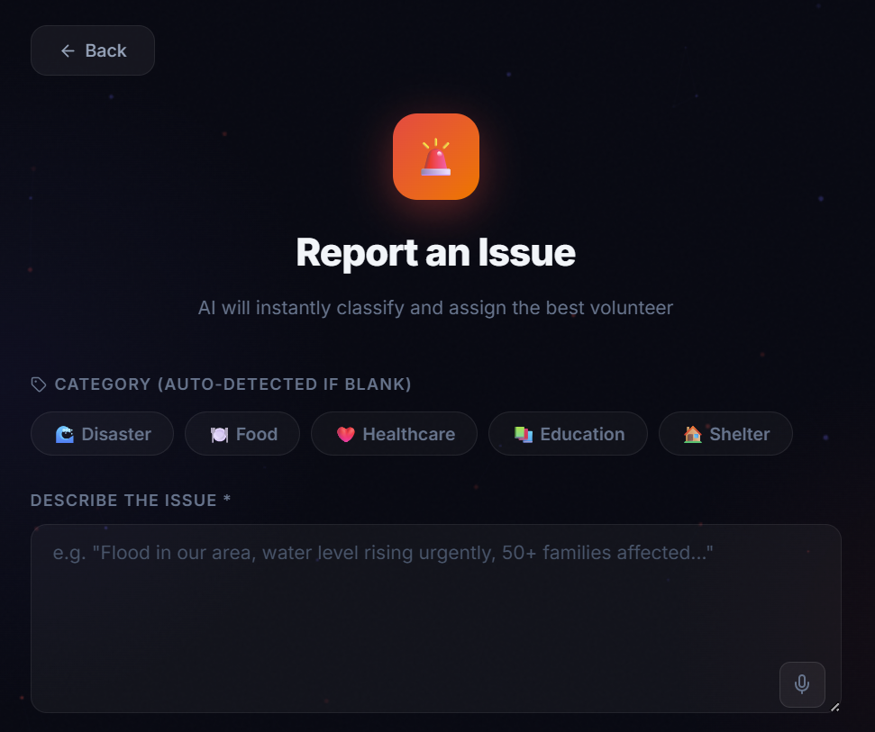
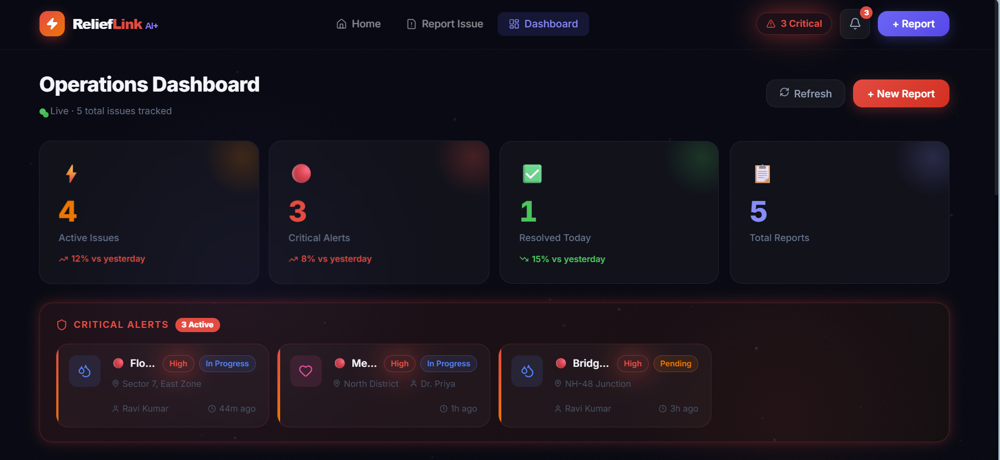

# 🚀 ReliefLink AI+

> Transforming disaster response into a real-time, AI-powered decision system

---

## 🧠 Overview

ReliefLink AI+ is an intelligent platform that enables users to report real-world issues, automatically classifies them using AI, and displays them in a live operations dashboard for faster and smarter decision-making.

The system shifts traditional reporting from reactive to proactive by highlighting critical alerts and providing real-time insights.

---

## ✨ Key Features

* 🤖 **AI Issue Classification** (category + priority detection)
* ⚡ **Real-Time Dashboard Updates**
* 🚨 **Critical Alerts Highlighting**
* 📊 **Interactive Operations Dashboard**
* 🎯 **Priority & Status Filtering**
* 🧠 **AI Preview Before Submission**
* 🎤 **Voice Input for Reporting**
* 🎨 **Modern UI with Animations (Framer Motion)**

---

## 🖥️ Application Screens

### 🏠 Home Page

* Live system status
* Clear call-to-action for reporting issues

### 📝 Report Issue Page

* AI-assisted issue description
* Auto-detection of category
* Voice input support

### 📊 Dashboard

* Live issue tracking
* Critical alerts panel
* Real-time statistics and insights

---

## 📸 Demo

### 🏠 Home



### 📝 Report Issue



### 📊 Dashboard



---

## ⚙️ Tech Stack

### Frontend

* React.js
* Tailwind CSS
* Framer Motion

### Backend

* Node.js
* Express.js

### AI Layer

* Custom classification logic

---

## 🚀 How to Run

### 1. Clone the repository

```bash
git clone https://github.com/Harixplorer/ReliefLink-AI.git
cd ReliefLink-AI
```

### 2. Install dependencies

```bash
npm install
cd frontend && npm install
cd ../backend && npm install
```

### 3. Run the application

#### Start Backend

```bash
cd backend
node server.js
```

#### Start Frontend

```bash
cd frontend
npm run dev
```

---

## 💡 Problem Statement

Traditional issue reporting systems are slow, reactive, and lack prioritization. Critical problems often get buried in large volumes of reports.

---

## 🎯 Our Solution

ReliefLink AI+ introduces:

* Instant AI classification
* Priority-based alerting
* Real-time monitoring dashboard

This enables faster response, better resource allocation, and improved crisis management.

---

## 🔮 Future Enhancements

* 🌍 Live map integration
* 📡 Real-time notifications
* 🤝 Volunteer assignment system
* 📈 Predictive analytics for crisis detection

---

## 👥 Team Members

* **Harshith Redy Jaggavarapu**
* **Seelam Bhavana**
* **Konduru Rithvik**

---

## 🏁 Conclusion

ReliefLink AI+ demonstrates how AI and real-time systems can significantly improve disaster response and community issue management.

---

⭐ If you found this project interesting, consider giving it a star!
